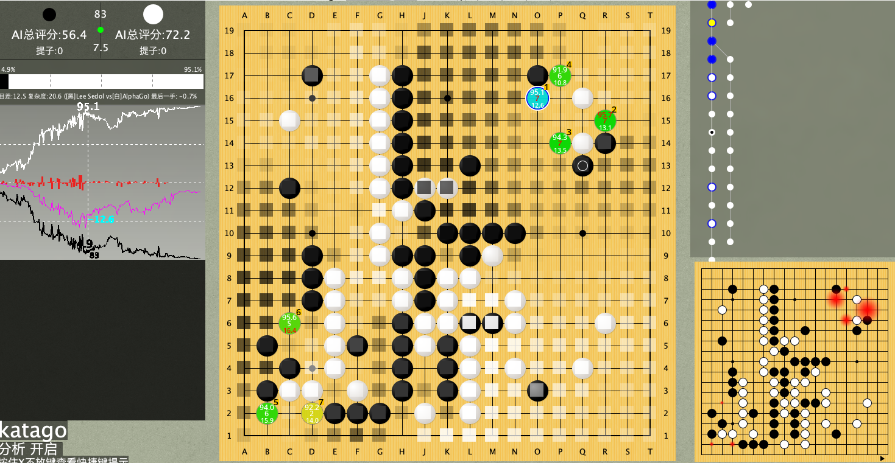
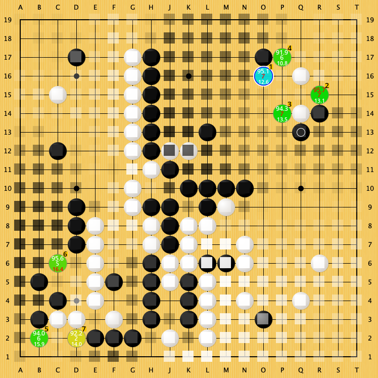

# katago 围棋复盘手机版

随着alphago的发展，越来越多围棋爱好者选择使用围棋ai 进行复盘。包括但不限于leela  katago。

而katago相比其他ai而言，更具有优势。例如 支持 让子、形势判断、不退让等等。

下面介绍如果在pc和手机上使用katago进行复盘与对弈

## pc上使用




#### 1 安装java环境


#### 2 下载lizzie https://github.com/featurecat/lizzie/releases

 或者下载lizzieyzy增强版本

#### 3 下载katago 和权重 https://github.com/lightvector/KataGo/releases

mac 用户可以自行编译 或者 使用brew 安装

```shell
brew install katago
```

#### 4 修改 config.txt 里 engine-command

```
C:\katago  gtp -config C:\gtp.cfg -model C:\g170e-b20c256x2-s2430231552-d525879064.bin.gz
```

mac 用户大概如下

```shell
/usr/local/Cellar/katago/1.3.2/bin/katago gtp -config /usr/local/Cellar/katago/1.3.2/share/katago/configs/gtp_example.cfg -model /usr/local/Cellar/katago/1.3.2/share/katago/g170e-b15c192-s1672170752-d466197061.txt.gz
```

双击 lizzie即可运行。 初次运行需要等待较长时间

## katago 手机版




- [x] 支持远程复盘，使用自己的pc 自己的显卡，无需购买云算力。
- [x] 操作简单，在手机端与电脑端登录账户即可；
- [x] 复盘棋谱分享；
- [x] 查看别人分享的棋谱；
- [x] 本地记谱；
- [x] katago
- [x] 让子
- [x] 多路棋盘
- [x] 与ai对弈 且可选同等棋力
- [x] ai形势判断
- [x] 实时复盘
- [x] 离线复盘

### Support or Contact

手机版正在内测中。加群免费内测。正式版收费

qq群 [331953595](https://shang.qq.com/wpa/qunwpa?idkey=fea97bef5dad51a75755104781c169998e55b6cfa49d88fc23b5dc7db875bd2c)

加站长微信

